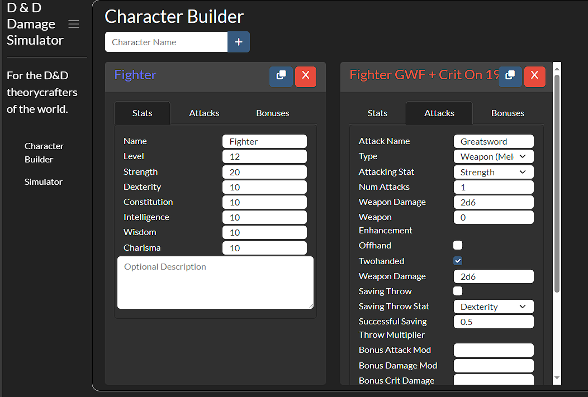
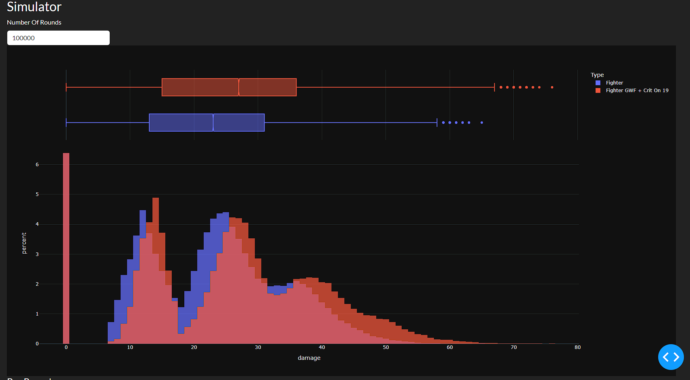

# Dungeons and Dragons Damage Simulator

##  For the D and D Theory Craftors of the World

* Simulates many thousand turns of combat to find distributions of damage for a given character
* Compare D&D characters at once for the theory crafters of the world, i.e.:
    * A Barbarian with Reckless Attacks with Advantage
    * A Fighter With the two Great Weapon Master Feat
* Not sure which Feat to take for optimal DPS? Well why not simulate them all and find out?

## Getting Started
* Currently the app only runs locally, install the requirements and then launch the web app:
    * Terminal install instructions:
    * Activate the virtual environment
        * `pipenv shell`
        * Install pipenv if needed `pip install pipenv` 
    * Install the requirements
        * `pip install --ignore-pipfile`
    * Launch the App on localhost 8050:
        * `python app.py`

## References/Motivation ##
* https://anydice.com/program/22f8c
* https://www.youtube.com/@DnDDeepDive
* https://www.reddit.com/r/BG3Builds/comments/157p0cl/the_math_of_critical_hits_in_dd_5e_is_critfishing/?onetap_auto=true
* https://statmodeling.stat.columbia.edu/2014/07/12/dnd-5e-advantage-disadvantage-probability/

# Technical Notes:

## Current Assumptions/Limitations ##
* Classes and Races are not fully implemented, just the main damaging perks
* Assume resources are unlimited (i.e. not tracking spell slots)
* No multitarget, single target only
* Enemys do not fight back/ not considering back and forth combat. So a character with 10 hp and 10 ac is just as good at damage as 100 hp and 20 ac
* Do not consider turn order/initive
* 1 character at a time, no party mode
* 1 Enemy at a time
* Focused on damage, therefore actions that do not involve damage as not implemented
* Validation of build feasability is not done. Garbage in/ garbage out, for example don't use dueling and GWF, the bonuses will be stacked since there is no check. 
* Crit on reductions needs to be applied manually, thing such as champion, spell sniper etc
* no status effects, stunned, restrained etc

# Features

## In Works
* UI design
    * Hook up characters to Simulator on the frontend
    * Enemy Section
* Double check values are indentical when readding elements

## TODO
* Summary Stats Section
* Character Presets
* Design of Experiments
    * Multiple enemy armor class
    * Per level
* "Leaderboard"
* Import and Export of characters via json
* Export Damage Results to csv

### Backlog
* Expendable resources/damage over time
* Turns to kill a monster
* Ability checks
* Monsters presets
* Saving/uploading presets
* Implement expensive callbacks in javascript? 
* 5e vs BG3 ruleset
* Concept of # of encounters per short/long rest for resources
* Extract "insights", i.e. when to turn on/off GWM/Sharpshooter
* Damage Source, to see impact of various combinations

### Implementation Quirks:
* Copy call back and is getting called when a character is deleted, because the Inputs techically change, but no button was clicked. 
    * Solution was to track the copy counts in state and not update if the triggering id's value was known and did not increment.
* Can not use MATCH when output doesn't have a MATCH, thus settled on reading in ALL Inputs